<h1 align="center">Codex Pooler</h1>

<p align="center">
  <strong>チームにも、エージェントにも、あなたにも。多機能なセルフホスト型 Codex ゲートウェイ。対応クライアント：</strong><br>
  <br>
  <a href="#codex-setup" title="Codex CLI and Codex Desktop"></a>
  <a href="#opencode-setup" title="OpenCode"></a>
  <a href="#openclaw-setup" title="OpenClaw"></a>
  <a href="#hermes-setup" title="Hermes Agent"></a>
  <a href="#pi-setup" title="Pi"></a>
  <a href="#omp-setup" title="OMP"></a>
  <a href="#omo-native-setup" title="OMO Native"></a>
  <a href="#cursor-setup" title="Cursor">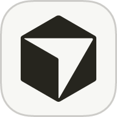</a>
  <a href="#kilo-code-setup" title="Kilo Code"></a>
  <a href="#trae-setup" title="Trae"></a>
  <a href="#aider-setup" title="Aider"></a>
  <a href="#continue-setup" title="Continue"></a>
  <a href="#cline-setup" title="Cline"></a>
  <a href="#goose-setup" title="Goose"></a>
  <a href="#deepseek-harness-setup" title="DeepSeek Harness"></a>
  <a href="#windmill-setup" title="Windmill AI"></a>
  <a href="#openhands-setup" title="OpenHands"></a>
  <a href="#openai-python-sdk-setup" title="OpenAI-compatible SDKs"></a>
  <a href="#openai-node-sdk-setup" title="OpenAI-compatible SDKs"></a>
  <a href="#vercel-ai-sdk-setup" title="Vercel AI SDK"></a>
</p>

<p align="center">
  <a href="README.md">English</a>
  ·
  <a href="README.zh-CN.md">简体中文</a>
  ·
  <a href="README.es.md">Español</a>
  ·
  <strong>日本語</strong>
</p>

<p align="center">
  <a href="https://www.codex-pooler.com">サイト</a>
  ·
  <a href="https://www.codex-pooler.com/docs/">ドキュメント</a>
  ·
  <a href="#quick-start-with-docker-compose">導入</a>
  ·
  <a href="#harness-configuration">クライアント設定</a>
  ·
  <a href="#configuration">設定</a>
  ·
  <a href="#deployment">デプロイ</a>
  ·
  <a href="https://x.com/icoretech_inc">X</a>
  ·
  <a href="https://reddit.com/r/CodexPooler">Reddit</a>
</p>

<p align="center">
  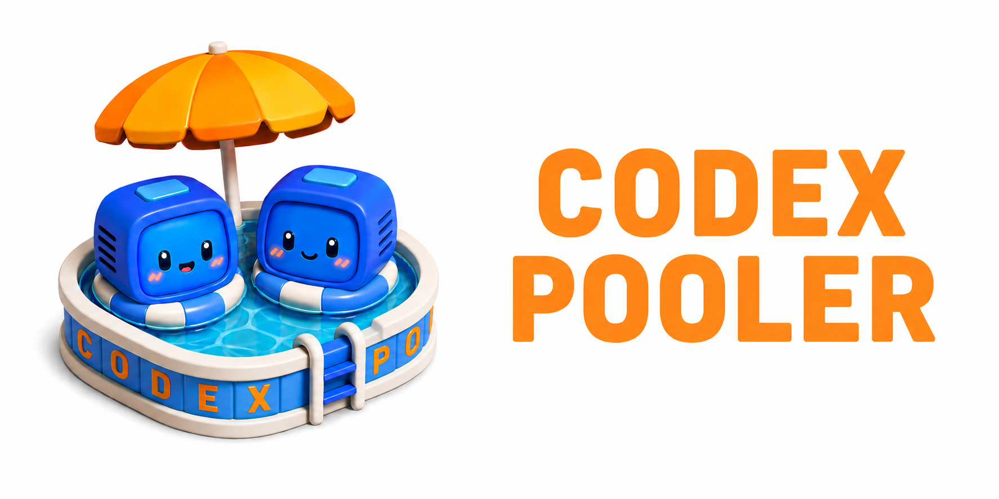
</p>

<table>
  <tr>
    <td align="center" valign="top" width="33%">
      <a href=".github/assets/screen1.png">
        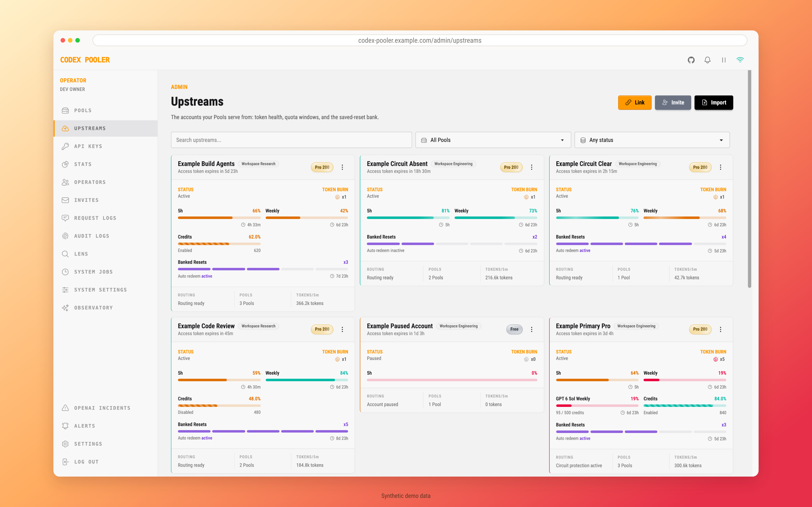
      </a><br>
      <sub>上流<br>アカウント</sub>
    </td>
    <td align="center" valign="top" width="33%">
      <a href=".github/assets/screen2.png">
        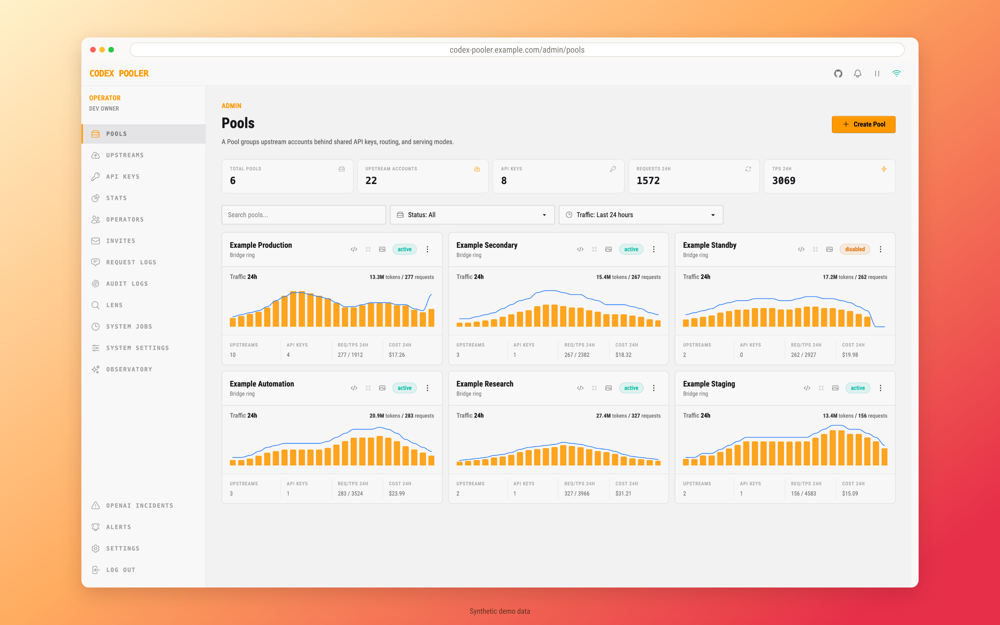
      </a><br>
      <sub>Pool</sub>
    </td>
    <td align="center" valign="top" width="33%">
      <a href=".github/assets/screen3.png">
        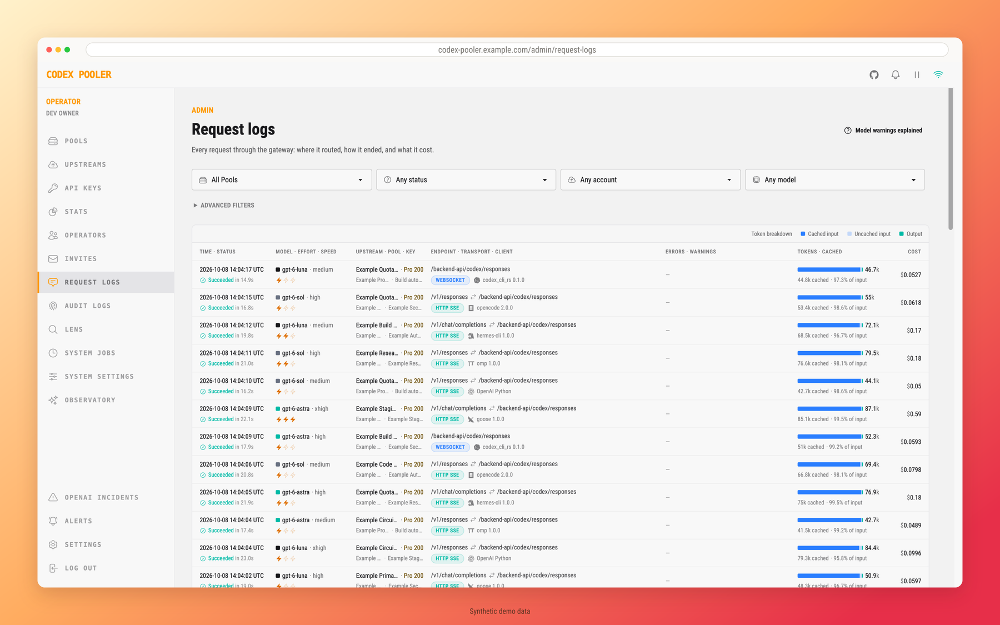
      </a><br>
      <sub>リクエスト<br>ログ</sub>
    </td>
  </tr>
</table>

Codex Pooler は、固定の Pool API キーを使って Codex 互換のエージェント、ツール、自動化を実行するためのセルフホスト型ゲートウェイです。上流の Codex アカウントが 1 つでも、認証情報の分離、クライアント間の差異の吸収、メタデータだけを扱う運用、保存済みリセットの可視化を利用できます。容量の共有や利用可能なアカウント間のルーティングが必要になったら、アカウントを追加できます。

クライアントは使い慣れた Codex バックエンド形式または OpenAI 互換形式のリクエストを送信します。Codex Pooler は、モデルの対応状況、クォータの実測情報、制限、セッションの継続性、ルーティングポリシー、健全性に基づいて利用可能なアカウントを選びます。背後で上流アカウントの割り当て、ライフサイクル状態、リセットポリシー、容量が変わっても、Pool キーは変わりません。

運用担当者は、プロンプト、ファイル、音声、画像、Bearer トークン、Codex の生のシークレットを保存することなく、Pool、アカウント、API キー、保存済みリセット、ルーティング、リクエストの利用量集計、監査ログ、健全性を一元管理できます。インスタンス所有者は全体の管理画面を利用でき、インスタンス管理者は割り当てられた Pool だけを操作します。

<a id="highlights"></a>

## 主な機能

- 🧩 **使い慣れたツールをそのまま利用：** Codex、OpenCode などの対応コーディングエージェントや、OpenAI 互換 SDK で作成したアプリを接続できます
- 🔑 **アプリの接続キーを 1 つに：** Codex アカウントを追加・交換しても変わらない Pool API キーでツールを接続でき、アカウントの認証情報を共有する必要がありません
- ⚡ **プロトコルをまたいで高いキャッシュ再利用率：** キャッシュを考慮したルーティングと接続の再利用により、HTTP/SSE と WebSockets で入力の 95% 超がキャッシュされた実績があります
- 🎯 **アカウントを自動選択：** 利用可能なクォータとアカウントの健全性を考慮し、選択したモデルを提供できるアカウントにリクエストを送信します
- 📏 **キーごとの利用量を制御：** リクエスト数の制限や、日次・週次の AI 利用枠を設定できます
- 🚀 **エージェントの作業の幅を拡大：** Full モードでは複数のツールを同時に使用でき、必要に応じて Lite の互換動作も利用できます
- 🖼️ **画像と音声にも対応：** 同じ Pool API キーを使い、対応アプリから画像の生成・編集や音声の文字起こしを実行できます
- 🛡️ **会話の内容を非公開のまま運用：** プロンプト、応答、アップロードしたファイル、画像、音声を保存せずに、利用状況の把握やリクエストのトラブルシューティングを行えます
- 🔁 **会話のつながりを維持：** クライアントが再接続しても、対応するセッションを適切なアカウントに紐付けたままにできます
- 🔭 **ユーザー自身で利用状況を確認：** キーごとに個人用の Observatory ダッシュボードを有効にし、アクティビティ、応答時間、推定コストを表示できます
- 🏦 **保存済みリセットを活用：** 利用可能なリセットクレジットを確認し、手動、または有効にした自動処理でアカウントのクォータを回復できます
- 🖥️ **すべてを一元管理：** ブラウザからアカウントの追加、キーや招待の管理、利用状況の確認、設定の変更ができます
- 👥 **チームやプロジェクトを整理：** アカウントを Pool にまとめ、それぞれにアクセスルールとモデルの選択肢を設定できます
- 🤝 **招待でアカウントを接続：** アカウント所有者はブラウザの案内に従って Pool に参加でき、認証情報ファイルを送る必要がありません
- 🚨 **対応が必要な状況を把握：** 容量の不足、アカウントの問題、リセットイベントについて、ダッシュボード、メール、Webhook で通知を受け取れます
- 🔎 **モデルのダウングレードを検出：** プロバイダーがリクエスト時とは異なるモデルを返した場合や、応答中にモデル名を変更した場合に確認できます
- 🧷 **不足している継続性の情報を補完：** クライアントがセッション識別情報を直接送信しない場合、キャッシュキーや会話 ID から安定した識別情報を導出します
- 🧱 **接続元を選択：** 必要に応じて、許可したネットワークからのリクエストだけを受け付けられます
- 🐳 **自分のインフラで運用：** Docker Compose で始め、規模に応じて Kubernetes にデプロイできます

<a id="harness-configuration"></a>

## クライアント設定

稼働中の Codex Pooler インスタンス、Pool API キー、インストール済みのクライアントを用意してください。以下の例には `gpt-6-luna`、`gpt-6.1-sol`、`gpt-6-astra` が含まれ、デフォルトでは Sol を選択しています。利用する Pool で提供されているモデルを残してください。`<pool-api-key>` を自分のキーに置き換え、クライアントを起動する前に、使用するターミナルに合ったコマンドを実行します。

**macOS / Linux / Windows WSL（bash または zsh）**

```bash
export CODEX_POOLER_API_KEY="<pool-api-key>"
```

**Windows PowerShell**

```powershell
$env:CODEX_POOLER_API_KEY = "<pool-api-key>"
```

これらのコマンドは現在のターミナルにキーを設定します。デスクトップアプリの場合は、リンク先のガイドに従ってアプリ用のキーを保存してください。

以下のパスはデフォルトです。macOS/Linux では、`~` はホームフォルダーを表します。Windows では、`%USERPROFILE%`、`%APPDATA%`、`%LOCALAPPDATA%` で始まるパスをエクスプローラーのアドレスバーに貼り付けてください。WSL 内にクライアントをインストールした場合は、WSL 内で Linux 用のパスとコマンドを使用します。独自の設定フォルダーやプロファイルがある場合は、そちらがデフォルトより優先されます。

ローカルインスタンスの場合：

| クライアント | ベース URL |
| --- | --- |
| Codex CLI / Desktop | `http://localhost:4000/backend-api/codex` |
| その他のクライアントと SDK | `http://localhost:4000/v1` |

デプロイ済みのインスタンスでは、`http://localhost:4000` を `https://codex-pooler.example.com` など、そのインスタンスのホストに置き換えてください。設定例は既存の設定に統合してください。以下の例では GPT-6 の大きな **828,400 トークンのコンテキスト**を使用します。Codex CLI と Desktop は、利用可能なコンテキストサイズを Pool から自動的に取得します。

各項目では基本的な接続方法を説明します。**詳しい設定と追加機能**のリンクには、インストール、高度なオプション、トラブルシューティングをまとめています。運用担当者向け MCP は任意の機能で、別のトークンを使用します。[運用担当者向け MCP サービス](#operator-mcp-service)を参照してください。

<a id="codex-setup"></a>

<details>
<summary> Codex CLI と Codex Desktop <code>config.toml</code></summary>


| OS | 設定ファイル |
| --- | --- |
| macOS / Linux | `~/.codex/config.toml` |
| Windows | `%USERPROFILE%\.codex\config.toml` |

使用する OS のパスにある `config.toml` を開き、以下を追加してください。`CODEX_HOME` を設定している場合は、そのフォルダー内のファイルを使用します。すでに `[features]` セクションがある場合は、そのセクションに設定を追加してください。

```toml
model = "gpt-6.1-sol"
model_provider = "codex-pooler-ws"

[model_providers.codex-pooler-ws]
name = "OpenAI"
base_url = "http://localhost:4000/backend-api/codex"
model_catalog_url = "http://localhost:4000/backend-api/codex/models"
env_key = "CODEX_POOLER_API_KEY"
wire_api = "responses"
supports_websockets = true
requires_openai_auth = true

[features]
api_key_model_discovery = true
```

Codex を再起動し、Pool で利用できるモデルを選択してください。Codex Desktop を使用する場合は、詳細ガイドに従ってアプリから API キーを利用できるようにしてください。

**[詳しい設定と追加機能](https://www.codex-pooler.com/docs/clients/codex-cli-desktop/)** — デスクトップのセットアップ、アカウント設定、既存の会話。

</details>

<a id="opencode-setup"></a>

<details>
<summary> OpenCode <code>opencode.jsonc</code></summary>


| OS | 設定ファイル |
| --- | --- |
| macOS / Linux | `~/.config/opencode/opencode.jsonc` |
| Windows | `%USERPROFILE%\.config\opencode\opencode.jsonc` |

使用する OS のパスにある `opencode.jsonc` を開き、OpenCode のバージョンに合った以下の設定を追加してください。

**OpenCode v2**

```jsonc
{
  "$schema": "https://opencode.ai/config.json",
  "model": "codex-pooler/gpt-6.1-sol",
  "agents": {
    "title": {
      "model": "codex-pooler/gpt-6-luna"
    }
  },
  "providers": {
    "codex-pooler": {
      "package": "@opencode/ai/providers/openai/responses",
      "settings": {
        "baseURL": "http://localhost:4000/v1",
        "apiKey": "{env:CODEX_POOLER_API_KEY}",
        "transport": "http",
        "compaction": {
          "type": "summary"
        }
      },
      "models": {
        "gpt-6-luna": {
          "modelID": "gpt-6-luna",
          "capabilities": {
            "tools": true,
            "input": ["text", "image"],
            "output": ["text"]
          },
          "limit": { "context": 828400, "input": 828400, "output": 32000 },
          "settings": {
            "reasoningEffort": "high",
            "reasoningSummary": "auto"
          }
        },
        "gpt-6.1-sol": {
          "modelID": "gpt-6.1-sol",
          "capabilities": {
            "tools": true,
            "input": ["text", "image"],
            "output": ["text"]
          },
          "limit": { "context": 828400, "input": 828400, "output": 32000 },
          "settings": {
            "reasoningEffort": "high",
            "reasoningSummary": "auto"
          }
        },
        "gpt-6-astra": {
          "modelID": "gpt-6-astra",
          "capabilities": {
            "tools": true,
            "input": ["text", "image"],
            "output": ["text"]
          },
          "limit": { "context": 828400, "input": 828400, "output": 32000 },
          "settings": {
            "reasoningEffort": "high",
            "reasoningSummary": "auto"
          }
        }
      }
    }
  }
}
```

**[OpenCode v2 の詳しい設定と追加機能](https://www.codex-pooler.com/docs/clients/opencode-v2/)** — インストールと高度なオプション。

**OpenCode v1**

```jsonc
{
  "$schema": "https://opencode.ai/config.json",
  "model": "openai/gpt-6.1-sol",
  "small_model": "openai/gpt-6-luna",
  "provider": {
    "openai": {
      "npm": "@ai-sdk/openai",
      "name": "Codex Pooler",
      "options": {
        "baseURL": "http://localhost:4000/v1",
        "apiKey": "{env:CODEX_POOLER_API_KEY}"
      },
      "models": {
        "gpt-6-luna": {
          "id": "gpt-6-luna",
          "name": "GPT-6 Luna",
          "family": "gpt",
          "attachment": true,
          "reasoning": true,
          "tool_call": true,
          "temperature": false,
          "options": {
            "reasoningEffort": "high",
            "reasoningSummary": "auto",
            "include": ["reasoning.encrypted_content"]
          },
          "modalities": {
            "input": ["text", "image"],
            "output": ["text"]
          },
          "limit": { "context": 828400, "input": 828400, "output": 64000 }
        },
        "gpt-6.1-sol": {
          "id": "gpt-6.1-sol",
          "name": "GPT-6.1 Sol",
          "family": "gpt",
          "attachment": true,
          "reasoning": true,
          "tool_call": true,
          "temperature": false,
          "options": {
            "reasoningEffort": "high",
            "reasoningSummary": "auto",
            "include": ["reasoning.encrypted_content"]
          },
          "modalities": {
            "input": ["text", "image"],
            "output": ["text"]
          },
          "limit": { "context": 828400, "input": 828400, "output": 64000 }
        },
        "gpt-6-astra": {
          "id": "gpt-6-astra",
          "name": "GPT-6 Astra",
          "family": "gpt",
          "attachment": true,
          "reasoning": true,
          "tool_call": true,
          "temperature": false,
          "options": {
            "reasoningEffort": "high",
            "reasoningSummary": "auto",
            "include": ["reasoning.encrypted_content"]
          },
          "modalities": {
            "input": ["text", "image"],
            "output": ["text"]
          },
          "limit": { "context": 828400, "input": 828400, "output": 64000 }
        }
      }
    }
  }
}
```

**[OpenCode v1 の詳しい設定と追加機能](https://www.codex-pooler.com/docs/clients/opencode/)** — インストールと OMO のセットアップ。

</details>

<a id="openclaw-setup"></a>

<details>
<summary> OpenClaw <code>openclaw.json</code></summary>

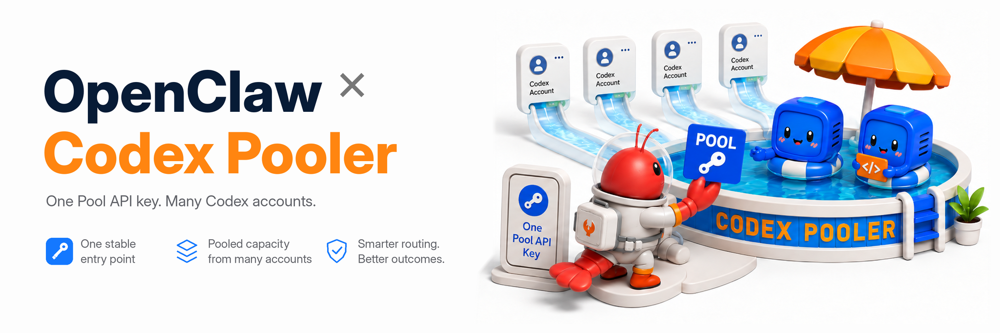

| OS | 設定ファイル |
| --- | --- |
| macOS / Linux | `~/.openclaw/openclaw.json` |
| Windows | `%USERPROFILE%\.openclaw\openclaw.json` |

使用する OS のパスにある `openclaw.json` を開き、以下の設定を追加してください。

```json5
{
  agents: {
    defaults: {
      model: {
        primary: "openai/gpt-6.1-sol",
        list: [{ id: "background", model: "openai/gpt-6-luna" }],
      },
      compaction: { reserveTokens: 128000 },
    },
  },
  models: {
    mode: "merge",
    providers: {
      openai: {
        baseUrl: "http://localhost:4000/v1",
        apiKey: "${CODEX_POOLER_API_KEY}",
        api: "openai-responses",
        agentRuntime: { id: "openclaw" },
        timeoutSeconds: 300,
        models: [
          {
            id: "gpt-6-luna",
            name: "GPT-6 Luna via Codex Pooler",
            reasoning: true,
            input: ["text", "image"],
            contextWindow: 828400,
            contextTokens: 828400,
            maxTokens: 128000,
          },
          {
            id: "gpt-6.1-sol",
            name: "GPT-6.1 Sol via Codex Pooler",
            reasoning: true,
            input: ["text", "image"],
            contextWindow: 828400,
            contextTokens: 828400,
            maxTokens: 128000,
          },
          {
            id: "gpt-6-astra",
            name: "GPT-6 Astra via Codex Pooler",
            reasoning: true,
            input: ["text", "image"],
            contextWindow: 828400,
            contextTokens: 828400,
            maxTokens: 128000,
          },
        ],
      },
    },
  },
}
```

OpenClaw を再起動し、新しい会話を開始してください。

**[詳しい設定と追加機能](https://www.codex-pooler.com/docs/clients/openclaw/)** — バックグラウンドタスク、モデルの追加、高度なオプション。

</details>

<a id="hermes-setup"></a>

<details>
<summary> Hermes Agent <code>config.yaml</code></summary>


| OS | `.env` と `config.yaml` のフォルダー |
| --- | --- |
| macOS / Linux | `~/.hermes/` |
| Windows | `%LOCALAPPDATA%\hermes\` |

使用する OS のフォルダーにある `.env` を開き、Pool API キーと Codex Pooler のアドレスを追加してください。`HERMES_HOME` を設定している場合は、そのフォルダーを使用します。

```dotenv
OPENAI_API_KEY=<pool-api-key>
OPENAI_BASE_URL=http://localhost:4000/v1
STT_OPENAI_BASE_URL=http://localhost:4000/v1
```

同じフォルダーの `config.yaml` に以下を追加し、Hermes を再起動してください。

```yaml
model:
  default: gpt-6.1-sol
  provider: openai-api
  base_url: http://localhost:4000/v1
  api_mode: codex_responses
  context_length: 828400
  supports_vision: true

agent:
  image_input_mode: native
  api_max_retries: 2
  auto_recovery_cycles: 1

image_gen:
  provider: openai
  model: gpt-image-2.5-flare-medium

stt:
  enabled: true
  provider: openai
  openai:
    model: gpt-4o-transcribe

compression:
  threshold: 0.95

auxiliary:
  compression:
    timeout: 900
```

この設定には画像生成と音声の文字起こしが含まれます。チャットモデルを切り替えるには、`model.default` を Pool で利用可能なモデルに設定してください。3 つのアドレスはすべて同じ Codex Pooler インスタンスを指すようにします。画像生成と文字起こしを利用するには、Pool がそれぞれのモデルも提供している必要があります。

**[詳しい設定と追加機能](https://www.codex-pooler.com/docs/clients/hermes/)** — 画像、音声の文字起こし、優先処理、トラブルシューティング。

</details>

<a id="pi-setup"></a>

<details>
<summary> Pi <code>models.json</code></summary>

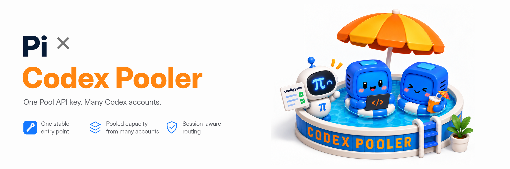

| OS | 設定ファイル |
| --- | --- |
| macOS / Linux | `~/.pi/agent/models.json` |
| Windows | `%USERPROFILE%\.pi\agent\models.json` |

使用する OS のパスにある `models.json` を開き、以下の設定を追加してください。

```json
{
  "providers": {
    "codex-pooler": {
      "name": "Codex Pooler",
      "baseUrl": "http://localhost:4000/v1",
      "api": "openai-responses",
      "apiKey": "$CODEX_POOLER_API_KEY",
      "authHeader": true,
      "models": [
        {
          "id": "gpt-6-luna",
          "name": "GPT-6 Luna via Codex Pooler",
          "reasoning": true,
          "input": ["text", "image"],
          "contextWindow": 828400,
          "maxTokens": 128000,
          "thinkingLevelMap": { "xhigh": "xhigh" }
        },
        {
          "id": "gpt-6.1-sol",
          "name": "GPT-6.1 Sol via Codex Pooler",
          "reasoning": true,
          "input": ["text", "image"],
          "contextWindow": 828400,
          "maxTokens": 128000,
          "thinkingLevelMap": { "xhigh": "xhigh" }
        },
        {
          "id": "gpt-6-astra",
          "name": "GPT-6 Astra via Codex Pooler",
          "reasoning": true,
          "input": ["text", "image"],
          "contextWindow": 828400,
          "maxTokens": 128000,
          "thinkingLevelMap": { "xhigh": "xhigh" }
        }
      ]
    }
  }
}
```

同じフォルダーの `settings.json` に、以下のデフォルト設定を追加してください。

```json
{
  "defaultProvider": "codex-pooler",
  "defaultModel": "gpt-6.1-sol",
  "enabledModels": [
    "codex-pooler/gpt-6-luna",
    "codex-pooler/gpt-6.1-sol",
    "codex-pooler/gpt-6-astra"
  ],
  "compaction": { "reserveTokens": 128000 }
}
```

続いて Pi を起動します。

```bash
pi
```

**[詳しい設定と追加機能](https://www.codex-pooler.com/docs/clients/pi/)** — インストール、デフォルトモデル、追加オプション。

</details>

<a id="omp-setup"></a>

<details>
<summary> OMP <code>models.yml</code></summary>

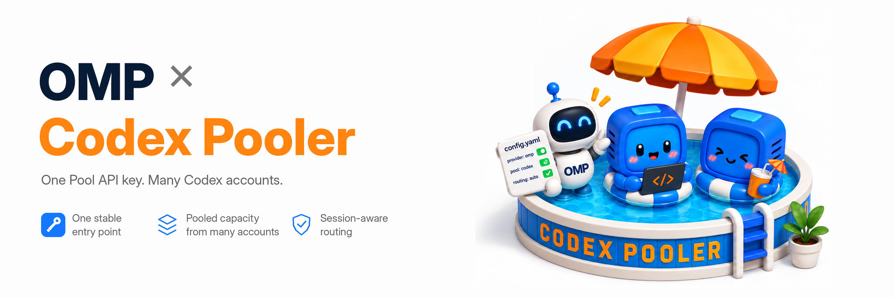

| OS | 設定ファイル |
| --- | --- |
| macOS / Linux | `~/.omp/agent/models.yml` |
| Windows | `%USERPROFILE%\.omp\agent\models.yml` |

使用する OS のパスにある `models.yml` を開き、以下の設定を追加してください。

```yaml
providers:
  codex-pooler:
    baseUrl: http://localhost:4000/v1
    api: openai-responses
    apiKey: CODEX_POOLER_API_KEY
    authHeader: true
    remoteCompaction:
      enabled: true
      api: openai-codex-responses
      endpoint: http://localhost:4000/backend-api/codex/responses/compact
      v2StreamingEnabled: true
      v2Endpoint: http://localhost:4000/backend-api/codex/responses
    models:
      - id: gpt-6-luna
        name: GPT-6 Luna via Codex Pooler
        reasoning: true
        input: [text, image]
        compat:
          streamIdleTimeoutMs: 300000
        contextWindow: 828400
        maxTokens: 128000
      - id: gpt-6.1-sol
        name: GPT-6.1 Sol via Codex Pooler
        reasoning: true
        input: [text, image]
        compat:
          streamIdleTimeoutMs: 300000
        contextWindow: 828400
        maxTokens: 128000
      - id: gpt-6-astra
        name: GPT-6 Astra via Codex Pooler
        reasoning: true
        input: [text, image]
        compat:
          streamIdleTimeoutMs: 300000
        contextWindow: 828400
        maxTokens: 128000
```

同じフォルダーの `config.yml` に、以下のデフォルト設定を追加してください。

```yaml
startup:
  setupWizard: false
enabledModels:
  - codex-pooler/gpt-6-luna
  - codex-pooler/gpt-6.1-sol
  - codex-pooler/gpt-6-astra
modelProviderOrder:
  - codex-pooler
modelRoles:
  default: codex-pooler/gpt-6.1-sol:high
  smol: codex-pooler/gpt-6-luna:low
  tiny: codex-pooler/gpt-6-luna:minimal
  slow: codex-pooler/gpt-6-astra:xhigh
  plan: codex-pooler/gpt-6-astra:xhigh
  task: codex-pooler/gpt-6.1-sol:high
  vision: codex-pooler/gpt-6.1-sol:high
  advisor: codex-pooler/gpt-6.1-sol:medium
  commit: codex-pooler/gpt-6-luna:minimal
  designer: codex-pooler/gpt-6-astra:high
compaction:
  enabled: true
  thresholdPercent: 80
  reserveTokens: 128000
  remoteStreamingV2Enabled: true
  midTurnEnabled: true
  handoffSaveToDisk: true
  methodOrder: [remote, soft]
```

80% で圧縮を開始することで、圧縮用の指示と直近のツール結果に必要な領域を確保します。`reserveTokens` は出力上限に合わせてください。すでに上限に近い既存のセッションについては、[圧縮からの復旧に関する説明](https://www.codex-pooler.com/docs/clients/omp/#troubleshooting)を参照してください。

続いて OMP を起動します。

```bash
omp
```

**[詳しい設定と追加機能](https://www.codex-pooler.com/docs/clients/omp/)** — インストール、モデルの選択、長い会話。

</details>

<a id="omo-native-setup"></a>

<details>
<summary> OMO Native <code>models.json</code></summary>

スタンドアロンの `omo` クライアントと、同梱の Senpi エンジンを Pool に接続します。OpenCode 内の OMO を使う場合は、[OpenCode の設定](#opencode-setup)を参照してください。

| OS | 設定ファイル |
| --- | --- |
| macOS / Linux | `~/.omo/agent/models.json` |
| Windows | `%USERPROFILE%\.omo\agent\models.json` |

既存のプロバイダーを残したまま、以下のプロバイダーを `models.json` に追加してください。

```json
{
  "providers": {
    "codex-pooler": {
      "baseUrl": "https://codex-pooler.example.com/v1",
      "api": "openai-responses",
      "apiKey": "$CODEX_POOLER_API_KEY",
      "authHeader": true,
      "models": [
        { "id": "gpt-6.1-sol", "reasoning": true, "defaultThinkingLevel": "medium", "input": ["text"] },
        { "id": "gpt-6-luna", "reasoning": true, "defaultThinkingLevel": "low", "input": ["text"] },
        { "id": "gpt-6-astra", "reasoning": true, "defaultThinkingLevel": "high", "input": ["text"] }
      ]
    }
  }
}
```

API キー参照の `$` は残し、例の URL を自分の Pooler の `/v1` URL に置き換えてください。Pool で利用可能なモデルだけを残します。Sol で起動するには：

```bash
omo --provider codex-pooler --model gpt-6.1-sol --thinking medium
```

この設定はテキストリクエスト向けです。ガイドには、デフォルト設定の保存と、ツールを使わない接続確認も含まれています。

**[詳しい設定と追加機能](https://www.codex-pooler.com/docs/clients/omo-native-senpi/)** — インストール、デフォルトモデル、接続確認。

</details>

<a id="cursor-setup"></a>

<details>
<summary> Cursor <code>Settings → Models → API Keys</code></summary>

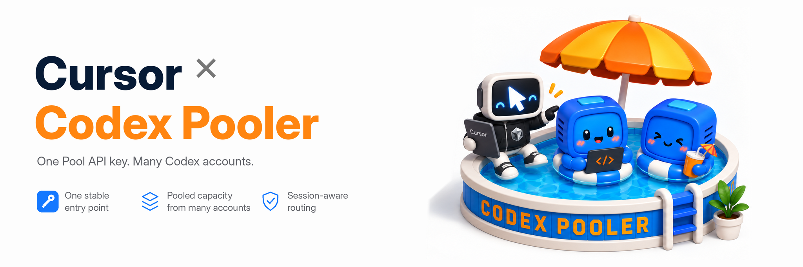

**Settings → Models → API Keys** で、**OpenAI API Key** と **Override OpenAI Base URL** を有効にしてください。Pool API キーと、`https://codex-pooler.example.com/v1` などの公開 HTTPS URL を入力し、Pool で利用できるモデルを選択します。

Cursor の BYOK には **Pro 以上**が必要です。リクエストは Cursor のサーバーを経由するため、localhost やプライベート LAN の URL は使用できません。Auto モードではなく、モデルを明示的に選択してください。

**[詳しい設定と追加機能](https://www.codex-pooler.com/docs/clients/cursor/)** — 前提条件、モデルの選択、接続確認。

</details>

<a id="kilo-code-setup"></a>

<details>
<summary> Kilo Code <code>kilo.jsonc</code></summary>

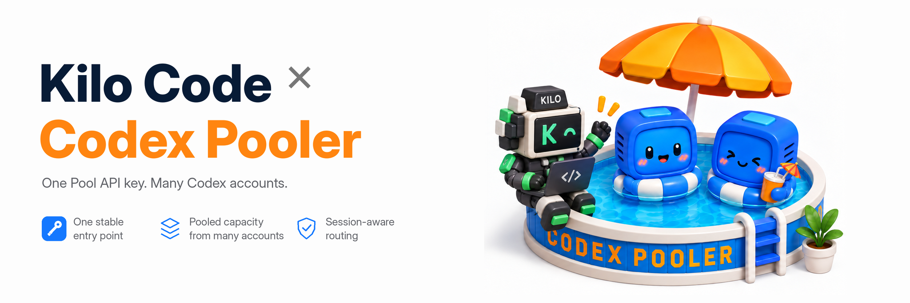

| OS | 設定ファイル |
| --- | --- |
| macOS / Linux | `~/.config/kilo/kilo.jsonc` |
| Windows | `%USERPROFILE%\.config\kilo\kilo.jsonc` |

使用する OS のパスにある `kilo.jsonc` を開き、以下の設定を追加してください。

```jsonc
{
  "$schema": "https://app.kilo.ai/config.json",
  "model": "codex-pooler/gpt-6.1-sol",
  "enabled_providers": ["codex-pooler"],
  "provider": {
    "codex-pooler": {
      "options": {
        "apiKey": "{env:CODEX_POOLER_API_KEY}",
        "baseURL": "http://localhost:4000/v1"
      },
      "models": {
        "gpt-6-luna": {
          "name": "GPT-6 Luna via Codex Pooler",
          "tool_call": true,
          "reasoning": true,
          "temperature": false,
          "attachment": true,
          "modalities": {
            "input": ["text", "image"],
            "output": ["text"]
          },
          "limit": { "context": 828400, "input": 828400, "output": 64000 }
        },
        "gpt-6.1-sol": {
          "name": "GPT-6.1 Sol via Codex Pooler",
          "tool_call": true,
          "reasoning": true,
          "temperature": false,
          "attachment": true,
          "modalities": {
            "input": ["text", "image"],
            "output": ["text"]
          },
          "limit": { "context": 828400, "input": 828400, "output": 64000 }
        },
        "gpt-6-astra": {
          "name": "GPT-6 Astra via Codex Pooler",
          "tool_call": true,
          "reasoning": true,
          "temperature": false,
          "attachment": true,
          "modalities": {
            "input": ["text", "image"],
            "output": ["text"]
          },
          "limit": { "context": 828400, "input": 828400, "output": 64000 }
        }
      }
    }
  }
}
```

Kilo を再起動し、Codex Pooler のモデルを選択してください。

**[詳しい設定と追加機能](https://www.codex-pooler.com/docs/clients/kilo-code/)** — インストール、モデルの選択、追加オプション。

</details>

<a id="trae-setup"></a>

<details>
<summary> Trae <code>Settings -> Models</code></summary>

Trae にサインインし、**Settings → Models** を開いてカスタムモデルを追加してください。

| 項目 | 値 |
| --- | --- |
| API 形式（API format） | OpenAI Chat Completions |
| カスタムリクエスト URL（Custom Request URL） | `http://localhost:4000/v1` |
| 完全な URL（Full URL） | オフ |
| モデル ID（Model ID） | `gpt-6.1-sol` |
| API キー（API key） | 自分の Pool API キー |
| モデル系列（Model Series） | デフォルト |

別のモデル ID で同じ設定を繰り返すと、Pool で利用可能なモデルを追加できます。

URL の末尾にスラッシュを付けないでください。モデルを保存し、エージェントのモデル選択画面で **Auto Mode** をオフにして、**Custom Models** からそのモデルを選択します。

**[詳しい設定と追加機能](https://www.codex-pooler.com/docs/clients/trae/)** — Trae CN、追加設定、接続確認。

</details>

<a id="aider-setup"></a>

<details>
<summary> Aider <code>.aider.conf.yml</code></summary>

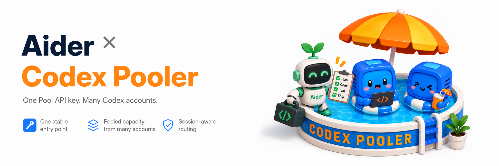

| OS | 設定ファイル |
| --- | --- |
| macOS / Linux | `~/.aider.conf.yml` |
| Windows | `%USERPROFILE%\.aider.conf.yml` |

使用する OS のパスにある `.aider.conf.yml` を開き、以下の設定を追加してください。

```yaml
model: openai/gpt-6.1-sol
openai-api-base: http://localhost:4000/v1
```

Pool API キーを環境変数に保持し、リポジトリから Aider を起動します。

**macOS / Linux / WSL**

```bash
export OPENAI_API_KEY="$CODEX_POOLER_API_KEY"
aider
```

**Windows PowerShell**

```powershell
$env:OPENAI_API_KEY = $env:CODEX_POOLER_API_KEY
aider
```

Aider がモデルを認識しない場合は、詳細ガイドの追加設定に従ってください。

モデルを切り替えるには、`openai/` プレフィックスを残して、`model` を Pool で利用可能なモデルに設定します。

**[詳しい設定と追加機能](https://www.codex-pooler.com/docs/clients/aider/)** — モデルの追加設定とファイルの編集。

</details>

<a id="continue-setup"></a>

<details>
<summary> Continue <code>config.yaml</code></summary>

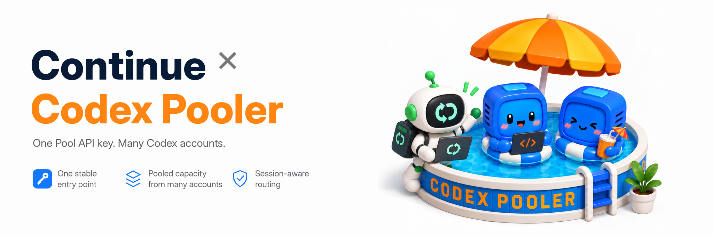

| OS | 設定ファイル |
| --- | --- |
| macOS / Linux | `~/.continue/config.yaml` |
| Windows | `%USERPROFILE%\.continue\config.yaml` |

[シークレットの設定手順](https://www.codex-pooler.com/docs/clients/continue/)に従い、Pool API キーを Continue に `CODEX_POOLER_API_KEY` として保存してください。その後、使用する OS のパスにある `config.yaml` を開き、以下の設定を追加します。

```yaml
name: Codex Pooler
version: 1.0.0
schema: v1

models:
  - name: GPT-6 Luna via Codex Pooler
    provider: openai
    model: gpt-6-luna
    apiBase: http://localhost:4000/v1
    apiKey: "${{ secrets.CODEX_POOLER_API_KEY }}"
    contextLength: 828400
    defaultCompletionOptions:
      maxTokens: 128000
    roles: [chat, edit, apply, summarize]
    capabilities: [tool_use, image_input]
  - name: GPT-6.1 Sol via Codex Pooler
    provider: openai
    model: gpt-6.1-sol
    apiBase: http://localhost:4000/v1
    apiKey: "${{ secrets.CODEX_POOLER_API_KEY }}"
    contextLength: 828400
    defaultCompletionOptions:
      maxTokens: 128000
    roles: [chat, edit, apply, summarize]
    capabilities: [tool_use, image_input]
  - name: GPT-6 Astra via Codex Pooler
    provider: openai
    model: gpt-6-astra
    apiBase: http://localhost:4000/v1
    apiKey: "${{ secrets.CODEX_POOLER_API_KEY }}"
    contextLength: 828400
    defaultCompletionOptions:
      maxTokens: 128000
    roles: [chat, edit, apply, summarize]
    capabilities: [tool_use, image_input]
```

Continue で、この設定と Codex Pooler のモデルを選択してください。

**[詳しい設定と追加機能](https://www.codex-pooler.com/docs/clients/continue/)** — API キーの保存、追加設定、CLI の使い方。

</details>

<a id="cline-setup"></a>

<details>
<summary> Cline</summary>

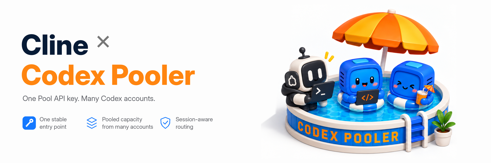

Cline CLI では、以下のコマンドで接続設定を保存します。

**macOS / Linux / WSL**

```bash
cline auth \
  --provider openai \
  --apikey "$CODEX_POOLER_API_KEY" \
  --baseurl http://localhost:4000/v1 \
  --modelid gpt-6.1-sol
```

**Windows PowerShell**

```powershell
cline auth --provider openai --apikey "$env:CODEX_POOLER_API_KEY" --baseurl http://localhost:4000/v1 --modelid gpt-6.1-sol
```

Cline を起動し、保存したモデルを使用してください。IDE 拡張機能では **OpenAI Compatible** を選択し、同じアドレス、API キー、モデルを入力します。

`--modelid` を Pool で利用可能なモデルに設定してください。

**[詳しい設定と追加機能](https://www.codex-pooler.com/docs/clients/cline/)** — IDE のセットアップ、追加設定、接続確認。

</details>

<a id="goose-setup"></a>

<details>
<summary> Goose <code>config.yaml</code></summary>

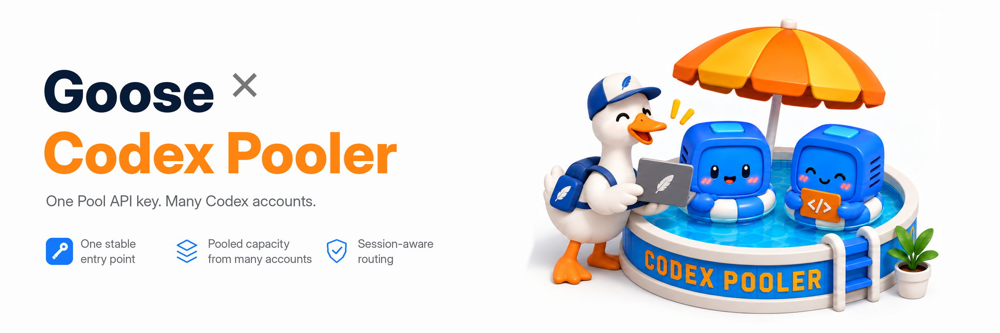

| OS | 設定ファイル |
| --- | --- |
| macOS / Linux | `~/.config/goose/config.yaml` |
| Windows | `%APPDATA%\Block\goose\config\config.yaml` |

使用する OS のパスにある `config.yaml` を開き、以下の設定を追加してください。

```yaml
GOOSE_PROVIDER: openai
GOOSE_MODEL: gpt-6.1-sol
OPENAI_HOST: http://localhost:4000
OPENAI_BASE_PATH: v1/chat/completions
GOOSE_CONTEXT_LIMIT: 828400
GOOSE_MAX_TOKENS: 128000
```

Goose を起動する前に、ターミナルで以下を実行してください。

**macOS / Linux / WSL**

```bash
export OPENAI_API_KEY="$CODEX_POOLER_API_KEY"
```

**Windows PowerShell**

```powershell
$env:OPENAI_API_KEY = $env:CODEX_POOLER_API_KEY
```

モデルを切り替えるには、`GOOSE_MODEL` を Pool で利用可能なモデルに設定します。

**[詳しい設定と追加機能](https://www.codex-pooler.com/docs/clients/goose/)** — ツール、追加設定、Windows のセットアップ。

</details>

<a id="deepseek-harness-setup"></a>

<details>
<summary> DeepSeek Harness (<code>dsh</code>) <code>cordis.patch.yml</code></summary>

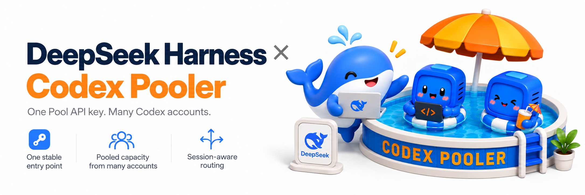

| OS | 設定ファイル |
| --- | --- |
| macOS / Linux | `~/.dsh/profiles/headless/cordis.patch.yml` |
| Windows | `%USERPROFILE%\.dsh\profiles\headless\cordis.patch.yml` |

`dsh --profile headless --dump-default-config` を一度実行して設定を作成し、使用する OS のパスにある `cordis.patch.yml` を開いて以下を追加してください。`DSH_HOME` を設定している場合は、その中の `profiles/headless` フォルダーを使用します。

```yaml
- id: llm-pi-ai
  config:
    providers:
      codex-pooler:
        apiKeyEnv: CODEX_POOLER_API_KEY
        api: openai-responses
        compat:
          supportsStrictMode: true
        baseURL: http://localhost:4000/v1
        models:
          - id: gpt-6-luna
            contextWindow: 828400
          - id: gpt-6.1-sol
            contextWindow: 828400
          - id: gpt-6-astra
            contextWindow: 828400
- id: agent-default-model
  config:
    provider: codex-pooler
    model: gpt-6.1-sol
```

設定を追加する際は、これらの項目の既存設定を残してください。`dsh --profile headless` で DeepSeek Harness を起動します。

**[詳しい設定と追加機能](https://www.codex-pooler.com/docs/clients/deepseek-harness/)** — インストール、ツール、追加設定。

</details>

<a id="windmill-setup"></a>

<details>
<summary> Windmill AI <code>customai</code> ワークスペースプロバイダー</summary>

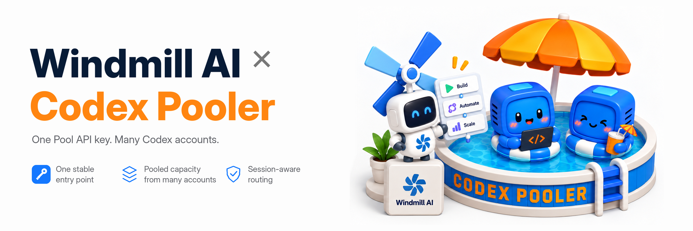

専用の Pool API キーを Windmill のシークレット変数として保存し、それを参照する `customai` リソースを作成してください。

```yaml
description: Codex Pooler API credentials for Windmill AI
value:
  api_key: '$var:u/<owner>/codex_pooler'
  base_url: http://localhost:4000/v1
  headers: {}
resource_type: customai
```

ワークスペースの AI 設定で、作成したリソースを指定し、3 つのモデルをすべて追加します。対応する設定は以下のとおりです。

```yaml
providers:
  customai:
    resource_path: u/<owner>/codex_pooler
    models:
      - gpt-6-luna
      - gpt-6.1-sol
      - gpt-6-astra
default_model:
  provider: customai
  model: gpt-6.1-sol
metadata_model:
  provider: customai
  model: gpt-6-luna
```

Windmill サーバーから到達できる URL を使用してください。プライベートアドレスを使う場合は、そのサーバーで `ALLOW_PRIVATE_AI_BASE_URLS=true` を設定する必要があります。

**[詳しい設定と追加機能](https://www.codex-pooler.com/docs/clients/windmill/)** — リソースの作成、ワークスペース設定、対応機能。

</details>

<a id="openhands-setup"></a>

<details>
<summary> OpenHands</summary>

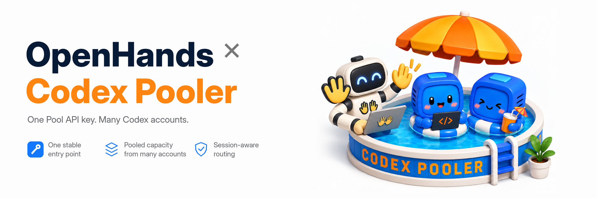

OpenHands Agent Canvas で、ネイティブの **OpenHands** エージェントを選択します。**Settings → LLM → Add LLM Profile → Advanced** で以下を設定してください。

- **Custom Model：** `openai/gpt-6-luna`（または Pool が提供する別の正確なモデル ID）
- **Base URL：** Canvas バックエンドから到達できる `https://codex-pooler.example.com/v1`
- **API Key：** 自分の Pool API キー

**Settings → Agent** でこの LLM プロファイルを紐付け、検証済みのツールワークフローには Full 提供モードを使用してください。ローカルの Pooler に Docker Desktop 上の Canvas から接続する場合は、`http://host.docker.internal:4000/v1` を使用します。

**[詳しい設定と追加機能](https://www.codex-pooler.com/docs/clients/openhands/)** — Docker のセットアップ、スクリーンショット、モデルプロファイル。

</details>

<a id="openai-python-sdk-setup"></a>

<details>
<summary> OpenAI Python SDK</summary>

OpenAI Python SDK をインストールし、`CODEX_POOLER_API_KEY` を設定したうえで、クライアントの接続先を Codex Pooler の `/v1` エンドポイントに設定します。

```python
import os

from openai import OpenAI

client = OpenAI(
    api_key=os.environ["CODEX_POOLER_API_KEY"],
    base_url="http://localhost:4000/v1",
)

response = client.responses.create(
    model="gpt-6.1-sol",
    input="Write a one-sentence status update.",
)

print(response.output_text)
```

Pool で利用可能なモデルを使用してください。

**[詳しい設定と追加機能](https://www.codex-pooler.com/docs/clients/openai-compatible/)** — ストリーミング、ツール、メディア、API の互換性。

</details>

<a id="openai-node-sdk-setup"></a>

<details>
<summary> OpenAI Node SDK</summary>

OpenAI Node SDK をインストールし、`CODEX_POOLER_API_KEY` を設定したうえで、クライアントの接続先を Codex Pooler の `/v1` エンドポイントに設定します。

```js
import OpenAI from "openai";

const client = new OpenAI({
  apiKey: process.env.CODEX_POOLER_API_KEY,
  baseURL: "http://localhost:4000/v1",
});

const response = await client.responses.create({
  model: "gpt-6.1-sol",
  input: "Write a one-sentence status update.",
});

console.log(response.output_text);
```

Pool で利用可能なモデルを使用してください。

**[詳しい設定と追加機能](https://www.codex-pooler.com/docs/clients/openai-compatible/)** — ストリーミング、ツール、メディア、API の互換性。

</details>

<a id="vercel-ai-sdk-setup"></a>

<details>
<summary> Vercel AI SDK</summary>

Vercel AI SDK をインストールし、`CODEX_POOLER_API_KEY` を設定したうえで、クライアントの接続先を Codex Pooler の `/v1` エンドポイントに設定します。

```ts
import { createOpenAI } from "@ai-sdk/openai";
import { generateText } from "ai";

const pooler = createOpenAI({
  apiKey: process.env.CODEX_POOLER_API_KEY,
  baseURL: "http://localhost:4000/v1",
});

const { text } = await generateText({
  model: pooler.responses("gpt-6.1-sol"),
  prompt: "Write a one-sentence status update.",
});

console.log(text);
```

Pool で利用可能なモデルを使用してください。

**[詳しい設定と追加機能](https://www.codex-pooler.com/docs/clients/openai-compatible/)** — ストリーミング、ツール、メディア、API の互換性。

</details>

<details>
<summary> Claude Code</summary>


</details>

<a id="quick-start-with-docker-compose"></a>

## Docker Compose でクイックスタート

公開済みのリリースイメージを、ローカルの Postgres データベースとともに実行します。ノート PC や小規模サーバーで Codex Pooler を試す最も手軽な方法です。
通常の利用には、[GitHub Releases](https://github.com/icoretech/codex-pooler/releases) のバージョンタグ付き安定版を使用してください。イメージタグ `latest` は直近の公開リリースを追従しますが、バージョンタグを指定すれば同じ構成を再現できます。ソースからの実行は[ローカル開発](#local-development)でのみ行ってください。

前提条件：

- Compose が使える Docker
- リポジトリをクローンする場合は Git
- `openssl`

Codex Pooler を起動します。

```bash
git clone https://github.com/icoretech/codex-pooler.git
cd codex-pooler

# Run the latest tagged stable release. Find its version at
# https://github.com/icoretech/codex-pooler/releases, then substitute it here.
export CODEX_POOLER_IMAGE_TAG=<release-tag>

scripts/self-host/generate-env.sh
docker compose pull
docker compose up -d
```

初回起動では、アプリと Postgres のイメージを取得し、Postgres が正常になるのを待ってマイグレーションコンテナを実行した後、ウェブアプリを起動します。

`http://localhost:4000` を開いてください。初回は `/bootstrap` で所有者アカウントを作成し、サインインして `/admin/pools` から始めます。

ブラウザを開く前に、初回起動時のリダイレクトを確認するには：

```bash
curl -sS -D - -o /dev/null http://localhost:4000/ | grep -i '^location: /bootstrap'
curl -fsS http://localhost:4000/bootstrap/status
```

新規データベースでは、ステータスエンドポイントが `{"status":"ok","bootstrap":"pending"}` を返すはずです。

よく使うコマンド：

```bash
docker compose ps
docker compose logs -f app
docker compose down
```

既存の Compose 環境をアップグレードするには、`.env` の `CODEX_POOLER_IMAGE_TAG` をアップグレード先の安定版リリースタグに設定し、以下を実行してください。

```bash
docker compose pull
docker compose up -d
```

Compose 構成には、一度だけ実行される `migrate` サービスがあります。このサービスは Postgres の準備を待ち、リリースのマイグレーションを実行して同梱の料金スナップショットをインポートし、ウェブアプリの起動前に終了します。通常のアプリ起動だけでは、データベースはマイグレーションされません。設定やデータベース接続の問題を修正した後、失敗したマイグレーションを再実行する必要がある場合は、以下を実行してください。

```bash
docker compose up -d db
docker compose run --rm migrate
docker compose up -d app
```

Phoenix の起動バナーに `https://localhost` などのエンドポイント URL が表示されても、デフォルトの Compose 構成には `http://localhost:4000` でアクセスしてください。ブラウザで開くローカル URL は Compose のポートマッピングに従います。リリースイメージには、運用担当者のタイムゾーン表示に使用する OS のタイムゾーンデータベースが含まれています。

ローカルデータベースも削除するには：

```bash
docker compose down -v
```

<a id="first-runtime-setup"></a>

## 初回のランタイム設定

初期セットアップ後：

1. `/admin/pools` で Pool を作成します
2. `/admin/upstreams` で 1 つ以上の Codex アカウントを連携、インポート、または招待します
3. `/admin/api-keys` で Pool API キーを作成します
4. Codex または SDK クライアントの接続先を、以下のランタイム用ベース URL のいずれかに設定します

上流アカウントは 1 つあれば動作します。上流アカウントを追加すると、クライアントの認証情報を変えずに、同じ Pool の容量を共有・拡張できます。

運用担当者が管理する新しい上流アカウントには、ブラウザでの認可が可能であれば、`/admin/upstreams` の `OAuth` を優先してください。管理ダイアログがアカウントを連携し、取得した認証情報を暗号化された上流シークレットストレージに保存します。完了後の画面ではメタデータのみを扱います。既存の Codex `auth.json` が適切な認証情報の取得元である場合に限り、`Import` を使用してください。

インポート後の Codex `auth.json` は、Codex Pooler が管理するものとして扱ってください。同じ `auth.json` を別の Codex 環境、マシン、自動化処理で使い続けると、プロバイダーのリフレッシュトークンのローテーションによって一方のコピーが無効になり、アカウントが `reauth_required` になる可能性があります。そのリスクを受け入れる場合を除き、併用しないでください。

ホスト型の招待オンボーディングと OAuth のデバイスコードへのフォールバックでは、OpenAI の Codex デバイスコード認可を使用します。この設定が必要なのは、その 2 つのフローだけです。ブラウザの OAuth 連携はこの設定に依存しません。個人の ChatGPT アカウントでは `chatgpt.com` を開き、Settings > Security で `Enable device code authorization for Codex` を有効にしてください。ワークスペースで管理されているアカウントでは、ワークスペース管理者に、権限設定で Codex のデバイスコードログインを有効にするよう依頼してください。デバイスコードログインについては、OpenAI の [Codex 認証ドキュメント](https://developers.openai.com/codex/auth)で説明されています。デバイスコード認可が無効だと、招待またはフォールバックのフローが OpenAI の承認段階で失敗することがあります。

```text
Codex backend base URL: http://localhost:4000/backend-api/codex
OpenAI SDK base URL:    http://localhost:4000/v1
```

生成された Pool API キーを Bearer トークンとして使用してください。このキーは単一の Codex アカウントではなく Pool を表すため、Codex Pooler はリクエストごとに最適な利用可能アカウントを選択できます。API キーの完全な値が表示されるのは、作成時またはローテーション時の一度だけです。

<a id="operator-roles"></a>

## 運用担当者のロール

初期セットアップで作成される最初のアカウントは `instance_owner` です。所有者はインスタンス全体を管理でき、Pool の作成、Pool への運用担当者の割り当て、運用担当者の管理、全体のジョブの確認、システム設定の変更を行えます。

追加の運用担当者は、所有者または `instance_admin` にできます。インスタンス管理者の権限は Pool 単位で、割り当てられた有効な Pool と、そこから得られるメタデータだけを扱えます。Pool が割り当てられていない場合、管理画面の Pool 単位の表示は空になり、全体のデータは公開されません。Pool をアーカイブまたは削除すると、インスタンス管理者はそれ以降、その Pool を閲覧できなくなります。アーカイブ済みまたは削除済みの Pool に関する過去のリクエスト・監査レコードは、所有者だけが閲覧できます。

<a id="runtime-compatibility"></a>

## ランタイムの互換性

特定のツールを接続する際は、各クライアントのガイドを参照してください。クライアントが使う公開 API 形式は、大きく 2 つに分かれます。

- **Codex バックエンドクライアント**は `/backend-api/codex` を使い、セッション、コンテキスト圧縮、ファイル、音声、画像、バックエンド WebSocket など、Codex ネイティブの機能を利用します。
- **OpenAI 互換クライアント**は `/v1` を使い、対応する SDK 形式の Responses、チャット、ファイル、音声、画像、モデル一覧の呼び出しを行います。

どちらも Pool API キーで認証し、同じ Pool ポリシー、アカウントの健全性、モデル対応、クォータの実測情報、セッション継続性、メタデータのみの利用量集計を通じてルーティングされます。Codex Pooler は意図的に、OpenAI のあらゆる API を無条件に転送するプロキシにはしていません。未対応の API は予測可能な形で失敗します。正確なルートの詳細は、[ランタイムルート](https://www.codex-pooler.com/docs/reference/runtime-routes/)のリファレンスと、[OpenAI 互換クライアントガイド](https://www.codex-pooler.com/docs/clients/openai-compatible/)を参照してください。

<a id="operator-mcp-service"></a>

## 運用担当者向け MCP サービス

Codex Pooler には、メタデータのみを扱う任意の MCP エンドポイント `/mcp` が含まれています。信頼できる運用担当者が、MCP ホストから Pool、上流アカウント、Pool API キーのメタデータ、運用担当者、招待、リクエストログ、監査ログ、MCP サービスの状態を確認できます。この運用担当者向けの追加機能は、Codex Pooler のランタイムクライアントには不要です。サービスは読み取り専用で、変更用ツールはありません。管理画面と同じく、所有者は全体を、管理者は割り当てられた Pool を閲覧する仕組みです。ただし、接続した MCP ホストはその運用担当者に見えるメタデータを読み取れるため、その情報を共有してよい信頼できるホストだけを接続してください。

MCP へのアクセスには、運用担当者が所有する Bearer 形式の MCP トークンを使用します。Pool API キー、ブラウザセッション、Cookie、クエリトークン、招待トークン、上流トークン、カスタムヘッダーは使用しません。運用担当者は `/admin/settings?tab=account` で自分の MCP アカウントの有効・無効とトークンを管理し、インスタンス全体のサービスの有効・無効は `/admin/system` で管理します。トークンを使うには、両方が有効になっている必要があります。MCP トークンの完全な値が表示されるのは作成時の一度だけです。キーごとの利用状況追跡、カウンター、最終 IP、ユーザーエージェント履歴は、意図的に保存しません。

`/mcp` ルートには、ランタイム入口の IP 許可リストと信頼するプロキシの設定が適用されます。許可リストが空の場合、ファイアウォールは無効です。設定されている場合は、MCP の認証やツール実行の前に、解決されたクライアント IP が許可リストに一致する必要があります。

<a id="configuration"></a>

## 設定

`scripts/self-host/generate-env.sh` は、生成したシークレットとローカル用のデフォルト値を含む `.env` を作成します。このファイルは非公開にし、公開インスタンス間で生成値を使い回さないでください。

環境変数には、リリースがデータベースを読み取れるようになる前に必要な値だけを設定します。

- `CODEX_POOLER_IMAGE` と `CODEX_POOLER_IMAGE_TAG`：実行するリリースイメージ
- `CODEX_POOLER_HTTP_PORT`：ローカルホストのポート。デフォルトは `4000`
- `DATABASE_URL`：アプリが使用する Postgres 接続
- `SECRET_KEY_BASE`：Phoenix の署名・暗号化シークレット
- `PHX_HOST`、`PORT`、`PHX_SERVER`：HTTP エンドポイントの起動設定
- `OBAN_MODE` と `OBAN_JOBS_QUEUE_LIMIT`：リリースのロールとキュー構成
- `DNS_CLUSTER_QUERY`：クラスタリングを有効にする場合は、リリースの分散実行用変数も設定
- `CODEX_POOLER_TOTP_ENCRYPTION_KEY` と `CODEX_POOLER_TOTP_KEY_VERSION`：TOTP 暗号化のルートキーとバージョン
- `CODEX_POOLER_UPSTREAM_SECRET_KEY` と `CODEX_POOLER_UPSTREAM_SECRET_KEY_VERSION`：上流シークレット暗号化のルートキーとバージョン。キーは生の 32 バイト、または 32 バイトを base64 エンコードした値である必要があります

ファイル制限、入口での信頼設定、ゲートウェイ診断、ルートクラス単位の受付制御、サーキットのしきい値、メトリクス認証、運用担当者のメール、モデルメタデータ、上流タイムアウト、OpenAI 料金カタログ URL、SMTP 配信などの運用設定は、`/admin/system` のデータベース管理のインスタンス設定にあります。動的な設定は、設定キャッシュを通じて新しいランタイム処理に適用されます。保存後は PubSub による無効化を通じてキャッシュが再読み込みされます。既存のリース、処理中のリクエスト、開いているストリームは、開始時の値を維持します。例外は、すでに開いている Responses WebSocket です。ランタイムファイアウォールの設定スナップショットがローカルに適用されると、ハンドシェイク時に記録したクライアント IP を再評価します。

インスタンス設定のシークレットは、UI では書き込み専用です。メトリクスの Bearer トークンは、鍵付き HMAC ダイジェスト、フィンガープリント、キーのバージョンとしてのみ保存されます。SMTP パスワードはキーのバージョンメタデータとともに暗号化して保存し、メール送信または認証情報のテスト時だけ復号します。

<a id="deployment"></a>

## デプロイ

Codex Pooler の運用方法に合ったデプロイ方法を選んでください。

| 方法 | 用途 | ガイド |
| --- | --- | --- |
| Docker Compose | ノート PC、検証用サーバー、小規模な単一ノードへの手軽なセルフホスト導入 | [Docker Compose デプロイガイド](https://www.codex-pooler.com/docs/deployment/docker-compose/) |
| Kubernetes | 本番環境、管理された Ingress、外部 Postgres、メトリクス、ランタイムロールの分離 | [Helm デプロイガイド](https://www.codex-pooler.com/docs/deployment/helm/) |

Kubernetes へのデプロイには、iCoreTech Helm リポジトリの [`icoretech/codex-pooler` チャート](https://github.com/icoretech/helm/tree/main/charts/codex-pooler)を使用します。このチャートは 1 つのリリースイメージを、ウェブ、ワーカー、スケジューラー、マイグレーションの独立したロールとして実行します。実際の導入では、チャートの `--version` を固定してください。チャートはデフォルトで、対応する `appVersion` を `image.tag` に使用します。

<a id="need-more-codex"></a>

## Codex をもっと活用するには

👉 [codex-action](https://github.com/icoretech/codex-action) は、GitHub Actions ワークフローで OpenAI Codex CLI を非対話的に実行します

👉 [codex-docker](https://github.com/icoretech/codex-docker) は、公式の上流リリースからビルドした、複数アーキテクチャ対応の OpenAI Codex CLI Docker イメージを提供します

<a id="local-development"></a>

## ローカル開発

ローカル開発では、Phoenix をホスト上で実行し、Postgres を開発用の Compose ファイルで起動します。

```bash
make dev
```

`make dev` は Postgres を起動し、データベースを準備して、同梱の OpenAI 料金データをインポートし、`http://localhost:4000` で Phoenix サーバーを起動します。ログはローカル開発サーバーのログファイルに書き込まれます。

開発用シードは任意で、明示的なシードタスクからのみ実行されます。所有者 1 名とサンプル運用担当者 4 名を含む、最小限で冪等な初期データを作成するには、以下を実行してください。

```bash
mix dev.seed compact
```

シードで作成される運用担当者は、全員 `dev-password-123` を使用します。

実際のアカウントやリクエストデータを使わずに、管理 UI のさまざまな状態を確認するための、より充実したダミーデータを再作成するには、以下を実行してください。

```bash
mix dev.seed full
```

full シードは冪等で、開発用シードの名前空間に属する、決定的に生成される `dev-*` のダミーレコードだけを置き換えます。有効・無効な Pool、有効・一時停止・失効した API キー、有効・更新・再認証・一時停止状態の上流アカウント、クォータ期間、リクエストログ、招待、監査イベント、ジョブレコードが含まれます。

よく使うチェック：

```bash
mix precommit
mix quality
docker compose -f docker-compose.dev.yml config
docker build .
```

Kubernetes のデプロイ動作や設定値を変更する場合、Helm チャートの検証は、iCoreTech Helm リポジトリの公開チャート側で行います。

`mix test` と `mix precommit` は、設定されたテストデータベースをキーとする PostgreSQL アドバイザリロックで、データベースを使うテスト実行を直列化します。そのため、同時にローカル実行しても、共有サンドボックスデータベースでデッドロックを起こさずに順番を待ちます。
